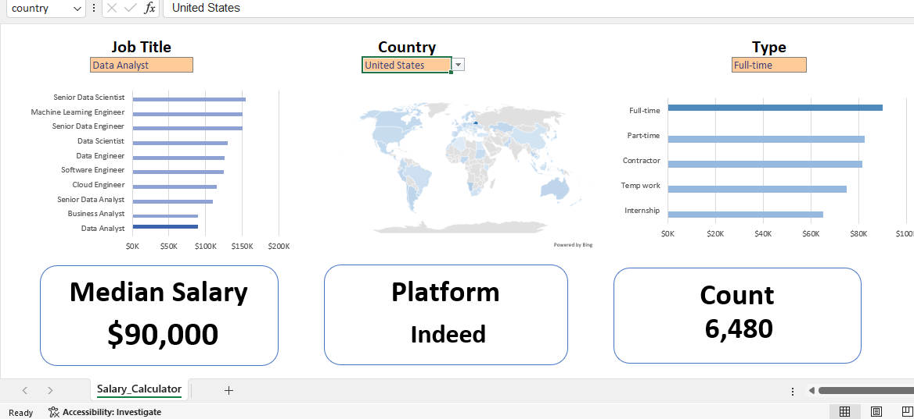
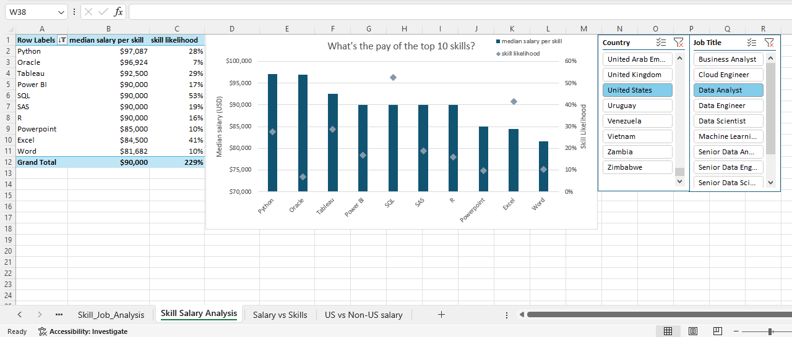

# Excel Data Analytics Portfolio: Salary & Job Market Analysis

This repository contains two comprehensive data analytics projects completed as part of the **"Excel for Data Analytics"** course by Luke Barousse. These projects demonstrate end-to-end data processing, from cleaning and transformation to interactive dashboard creation.

## 📊 Project 1: Interactive Salary Dashboard
An interactive tool designed to explore salary trends based on job titles and locations.

* **Objective:** To provide a user-friendly interface for predicting potential salaries based on specific career parameters.
* **Key Features:** Dynamic filtering, data validation, and interactive charting.

## 📈 Project 2: Data Science Job Market Analysis
A deep dive into the real-world data science job market, focusing on identifying high-value skills and demand.

* **Objective:** To answer critical business questions regarding the most in-demand skills and average pay across different data roles.
* **Insights:** Analyzed the intersection of "High Demand" vs. "High Pay" to identify optimal career paths.

---

## 🛠️ Technical Challenges & Workarounds (Excel 2019 Compatibility)
A significant part of this project involved overcoming software limitations. While the course was designed for Office 365, I completed all tasks using **Excel 2019**, which required finding creative workarounds for missing dynamic array functions:

1. **Unique Values:** Since `=UNIQUE` was unavailable, I utilized **Pivot Tables** to extract distinct job titles and categories from the dataset.
2. **Sorting:** In place of the `=SORT` function, I converted extracted data into **Excel Tables** and used manual filter/sort triggers to organize the information.
3. **Complex Conditional Logic (The CSE Method):** To calculate median salaries for specific job titles (where a standard `=MEDIAN(IF...)` failed), I implemented **Legacy Array Formulas**. 
   * **Solution:** I diagnosed the formula errors and applied **Ctrl+Shift+Enter** to wrap the logic in curly brackets `{ }`, allowing Excel 2019 to process the array calculations correctly.

---

## 🧠 Skills Demonstrated
* **Data Cleaning:** Handling missing values, parsing strings, and data standardization.
* **Advanced Formulas:** Nested IF statements, VLOOKUP/XLOOKUP, and Legacy Array Formulas (CSE).
* **Data Visualization:** Bar charts, Pivot Charts, and Dashboard Design.
* **Statistical Analysis:** Mean, Median, and Outlier detection.
* **Pivot Tables:** Data aggregation and multi-dimensional analysis.

## 📁 Repository Structure
* `/Ayman_Djemoui_Salary_Calculator/`: Contains the `.xlsx` file for the interactive dashboard.
* `/Ayman_Djemoui_Job_Market_Analysis/`: Contains the full analysis workbook and Pivot Table reports.
* `/Data/`: Raw datasets used for the analysis (attributed to Luke Barousse).

## 📝 Acknowledgments
Special thanks to **Luke Barousse** for the excellent course and for providing the datasets used in these projects.

---
### Contact & Connect
* **LinkedIn:** [Aymen Djemoui](https://www.linkedin.com/in/ayman-djemoui-249286126/)
* **Portfolio:** [GitHub Profile](https://github.com/ayman4data)
